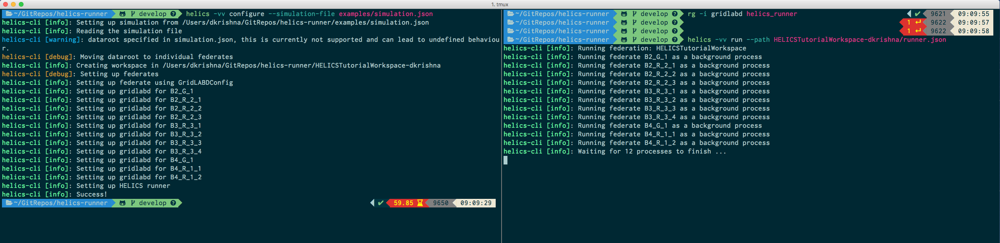

# helics-runner

Runner for Hierarchical Engine for Large-scale Infrastructure Co-Simulation (HELICS).



- Supports configurations of federates using plugins
- Allows running of federation using a runner configuration

### Documentation

```bash
$ helics --help

Usage: helics [OPTIONS] COMMAND [ARGS]...

  HELICS Runner command line interface

Options:
  --version                Show the version and exit.
  --verbose / -no-verbose
  --help                   Show this message and exit.

Commands:
  run       Run HELICS federation
  setup     Setup HELICS federation
  validate  Validate config.json

```

```bash
$ helics setup --help
Usage: helics setup [OPTIONS]

  Setup HELICS federation

Options:
  --path PATH
  --purge / --no-purge
  --help                Show this message and exit.
```

```bash
$ helics run --help

Usage: helics run [OPTIONS]

  Run HELICS federation

Options:
  --path PATH
  --silent
  --help       Show this message and exit.
```

```bash
$ helics validate --help

Usage: helics validate [OPTIONS]

  Validate config.json

Options:
  --path PATH
  --help       Show this message and exit.
```

### Usage

```bash
$ helics setup --path examples/echo-federation

$ helics validate --path examples/echo-federation/config.json
 - Valid keys in config.json
     - Valid keys in federate Federate1
     - Valid keys in federate Federate2

$ helics run --path examples/echo-federation/config.json
Running federation: HELICSFederation
Running federate Federate1 as a background process
Running federate Federate2 as a background process
  [##################------------------]   50%
Hello from Federate 1
Hello from Federate 2
  [####################################]  100%

```

### Installation

```
pip install git+git://github.com/GMLC-TDC/helics-cli.git@python-master
```

## Release
HELICS-cli is distributed under the terms of the BSD-3 clause license. All new
contributions must be made under this license. [LICENSE](LICENSE)

SPDX-License-Identifier: BSD-3-Clause

